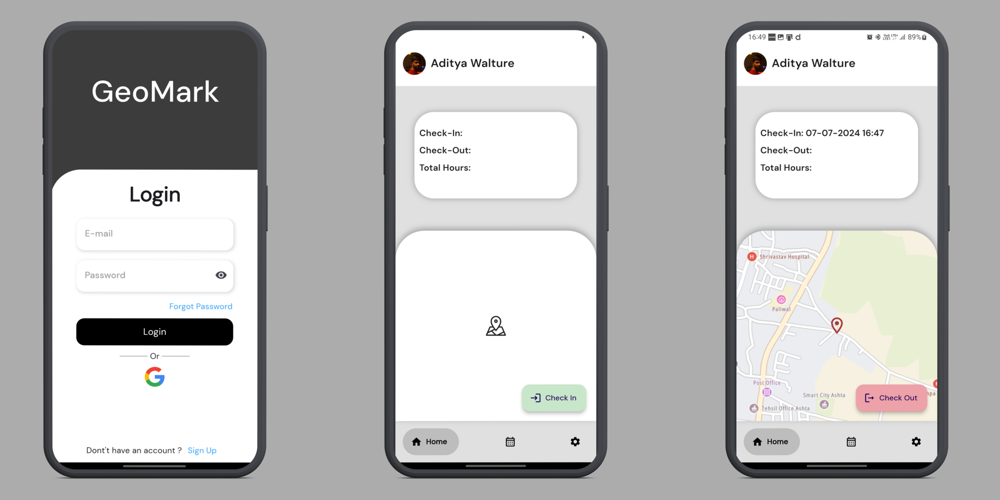
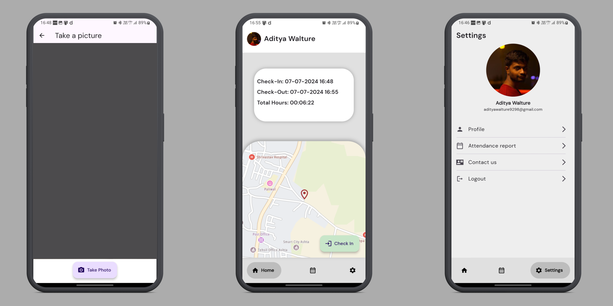

# GeoMark 📱

Flutter Attendance app for field workers, takes attendance with user's real-time location, time & takes image of the user as a proof.

## Screenshots

    

    

# Description
 App designed to mark attendance for field workers using real-time geolocation and capturing their image (selfie) as proof of their location. The app uses Firebase for user login authentication, including Google login, and TomTom Maps API for tracking user locations. It records check-in and check-out times, total hours worked, user selfies, and current locations. This data is stored in Firestore Database

# Dependecies and Api Used

    firebase_core
    firebase_auth
    firebase_storage
    cloud_firestore
    flutter_bloc
    connectivity
    google_sign_in
    google_nav_bar
    shared_preferences
    camera
    geolocator
    geocoding
    flutter_map
    http
    latlong2
    permission_handler: ^11.3.1
    
Api: <a href="https://developer.tomtom.com/">Tom-Tom maps</a> 